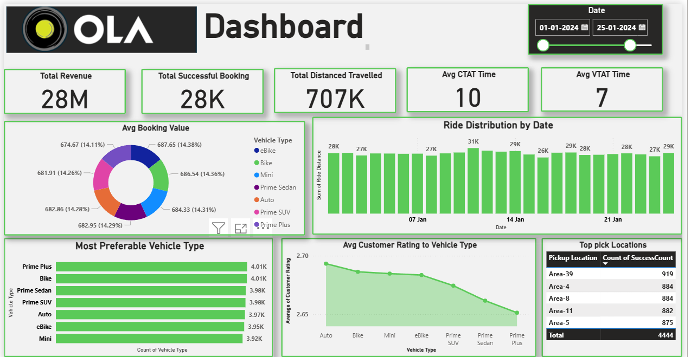

 Ola Data Analyst Project

Welcome to my Ola Data Analyst project! This repository contains the complete analysis of 50,000+ Ola ride records for Bengaluru city over a 1-month period. The project explores booking trends, cancellation patterns, ride demand fluctuations and more using SQL and Power BI with the goal of uncovering actionable insights.

<b>Dashboards and Insights</b>

Power BI Report: It provides detailed trends and patterns including cancellation analysis, booking success rates and more.

Dashboard: It shows interactive visuals for quick insights on key performance indicators (KPIs).
